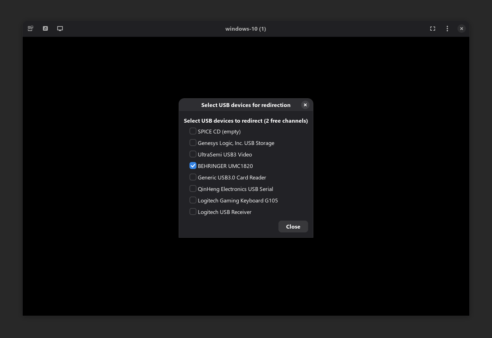

# Spice USB Redirect

Minimal Spice USB redirection GTK app.

This is a standalone version of the 'USB Redirect' dialog from [`virt-viewer`](https://gitlab.com/virt-viewer/virt-viewer):



It was made to be used alongside `LookingGlass` or other vm viewers that don't support usb redirection ([see LookingGlass#1261](https://github.com/gnif/LookingGlass/issues/1261)).

## Usage

Set the [`SPICE_DEBUG_ALLOW_MC=1`](https://www.spice-space.org/multiple-clients.html) environment variable when launching the VM.

Connect the app to a spice socket:

```sh
$ spice-usb-redirect spice.sock # or localhost:1337
...
```
